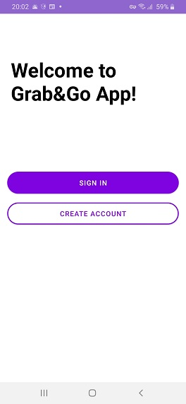
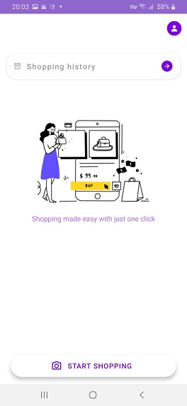
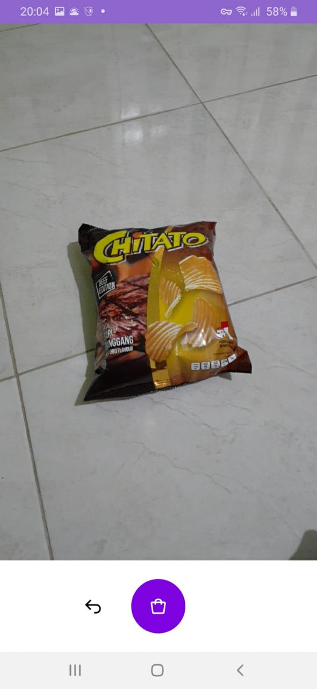
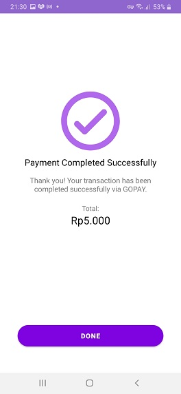

# Grab & Go for Android
Grab & Go is a object detection based shopping app

 

## Dataset used from the model: 
https://www.kaggle.com/hafizyusufheraldi/retail-product-dataset

 

## Libraries used:
- ViewBinding
- Lifecycles
- LiveData
- ViewModel
- Retrofit
- Navigation
- Dagger-Hilt
- Kotlin Coroutines
- Firebase-auth
- Camerax