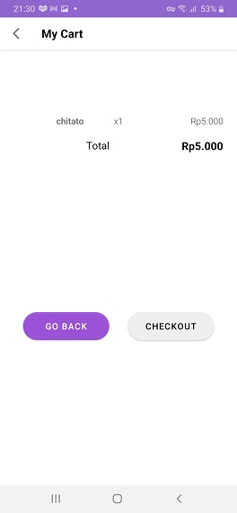

A project for Bangkit 2021 Capstone.
# Grab & Go for Android #

Grab & Go is an object detection based shopping app. Users can use their camera to add items into their cart and pay them directly from their own smartphones

Currently our model supports classification of 6 classes:
1. BBQ Chitato
2. Pepsodent
3. Aqua bottle
4. Lifebuoy shampoo
5. Nice tissue
6. Indomie

 

# Dataset used for the model #
https://www.kaggle.com/hafizyusufheraldi/retail-product-dataset

 

# Libraries used #
- ViewBinding
- Lifecycles
- LiveData
- ViewModel
- Retrofit
- Navigation
- Dagger-Hilt
- Kotlin Coroutines
- Firebase-auth
- Camerax

# Additional resources #

* Machine learning model
    * https://colab.research.google.com/drive/1FzWikcT1_xjw6Ze-1gxjoUW8GWk_N2uU?usp=sharing

* Dataset repository
    * https://github.com/dzakwansilverdi/grab-and-go-dataset

* Server backend repository
    * https://github.com/dzakwansilverdi/grab-and-go-core